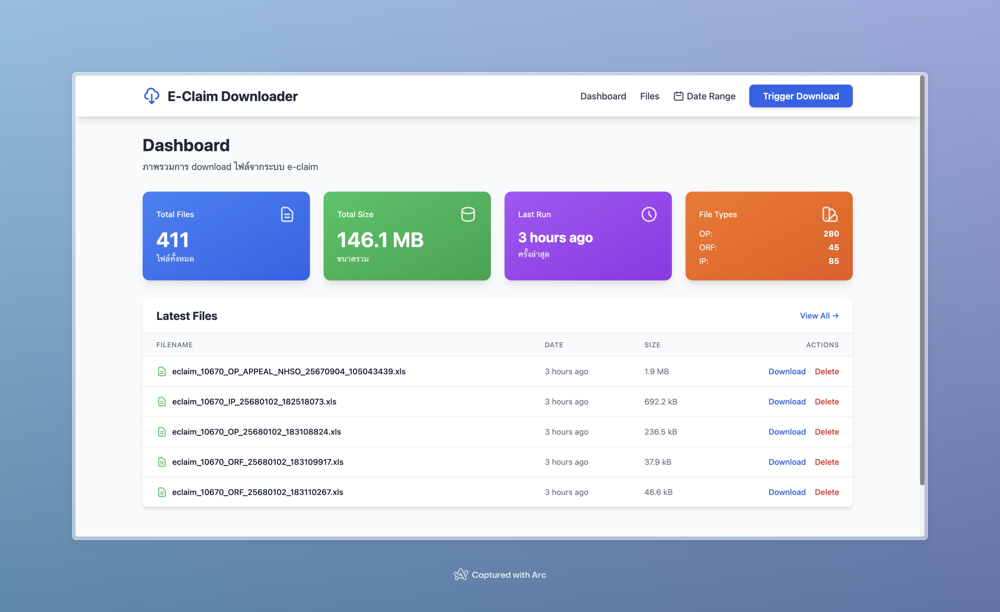

# NHSO Revenue Intelligence

> ระบบวิเคราะห์รายได้จากการเบิกจ่าย สปสช. - Hospital Revenue Analytics for NHSO E-Claim Reimbursements



[](https://opensource.org/licenses/MIT)
[](https://www.python.org/downloads/)
[](https://www.docker.com/)

---

## Support This Project

If you find this project helpful, consider buying me a coffee!

<a href="https://www.buymeacoffee.com/sathit" target="_blank"></a>

**Developer:** Sathit Seethaphon | [aegisx platform](https://github.com/aegisx-platform)

---

## Table of Contents

- [Overview](#-overview)
- [Key Features](#-key-features)
- [Quick Start](#-quick-start)
- [Documentation](#-documentation)
- [Screenshots](#-screenshots)
- [Requirements](#-requirements)
- [Project Structure](#-project-structure)
- [License](#-license)
- [Contributing](#-contributing)
- [Support](#-support)

---

## Overview

**NHSO Revenue Intelligence** (เดิมชื่อ E-Claim Downloader) เป็นระบบวิเคราะห์รายได้จากการเบิกจ่าย สปสช. สำหรับโรงพยาบาล ครอบคลุมตั้งแต่การ download ข้อมูล E-Claim, import เข้าฐานข้อมูล, วิเคราะห์รายได้, จนถึงกระทบยอดกับข้อมูล SMT Budget

**Version:** v3.0.0
**Last Updated:** 2026-01-11

### Data Sources

| Source | URL | Description |
|--------|-----|-------------|
| E-Claim | [eclaim.nhso.go.th](https://eclaim.nhso.go.th) | ข้อมูลการเบิกจ่าย (REP) |
| SMT Budget | [smt.nhso.go.th](https://smt.nhso.go.th) | ข้อมูลงบประมาณที่จ่ายจริง |

### Why This System?

- **Revenue Analytics** - วิเคราะห์รายได้จากการเบิกจ่ายแบบ real-time
- **Reconciliation** - กระทบยอด REP vs SMT อัตโนมัติ
- **Dashboard & KPIs** - ภาพรวมสำหรับผู้บริหารโรงพยาบาล
- **Automated Downloads** - ตั้งเวลา download อัตโนมัติได้
- **Multi-Database** - รองรับทั้ง PostgreSQL และ MySQL
- **Hospital Schema** - ใช้โครงสร้างตารางของโรงพยาบาลเป็นหลัก

---

## Key Features

### Revenue Dashboard
- **KPI Cards**: Total Claims, Total Reimbursement, Denial Rate
- **Service Type Distribution**: OP, IP, Refer, Emergency
- **Top Funds by Revenue**: แยกตามกองทุน
- **Quick Actions**: เข้าถึง Analytics, Reconciliation, Download

### Analytics Dashboard
- **Monthly Trends**: เทรนด์รายเดือน
- **DRG Analysis**: Top DRG, RW Distribution
- **Drug Analysis**: ยาที่เบิกมากที่สุด
- **Denial Analysis**: สาเหตุการปฏิเสธ
- **Fund Analysis**: วิเคราะห์ตามกองทุน
- **Fiscal Year Filter**: กรองตามปีงบประมาณ

### Reconciliation (REP vs SMT)
- **Claims vs Payments**: เปรียบเทียบยอดเบิก vs ยอดจ่าย
- **Monthly Comparison**: กระทบยอดรายเดือน
- **Discrepancy Detection**: ตรวจหาความต่าง
- **Export Reports**: ส่งออกรายงาน

### Data Management (All-in-One)
- **Download Tab**: Single month & Bulk download
- **Files Tab**: จัดการไฟล์ & Import status
- **SMT Sync Tab**: ดึงข้อมูล SMT Budget
- **Settings Tab**: Credentials & Scheduler

### Auto Scheduling
- ตั้งเวลา download ได้หลายช่วงต่อวัน
- Auto-import option
- Next run time display

### Database Import
- **Multi-Database**: PostgreSQL และ MySQL
- **Complete Mapping**: Map ทุก columns (170+ fields)
- **All File Types**: OP, IP, ORF, IP_APPEAL
- **UPSERT Logic**: ป้องกัน duplicate

---

## Quick Start

### Docker Deployment (Recommended)

```bash
# 1. Clone repository
git clone https://github.com/aegisx-platform/eclaim-rep-download.git
cd eclaim-rep-download

# 2. Setup environment
cp .env.example .env
nano .env  # Set ECLAIM_USERNAME and ECLAIM_PASSWORD

# 3. Start services
docker-compose up -d

# Other options:
# - MySQL: docker-compose -f docker-compose-mysql.yml up -d
# - Download-only: docker-compose -f docker-compose-no-db.yml up -d
```

### Access Points

| Service | URL | Description |
|---------|-----|-------------|
| Web UI | http://localhost:5001 | Main application |
| Dashboard | http://localhost:5001/dashboard | Revenue KPIs |
| Analytics | http://localhost:5001/analytics | Detailed analytics |
| Reconciliation | http://localhost:5001/reconciliation | REP vs SMT |
| Data Management | http://localhost:5001/data-management | Download, Files, Settings |

---

## Navigation Structure

```
NHSO Revenue Intelligence
├── Dashboard          - Revenue KPIs & Overview
├── Analytics          - Detailed Charts & Analysis
├── Reconciliation     - REP vs SMT Comparison
└── Data Management    - Download, Files, SMT, Settings
    ├── Download       - Single/Bulk download + Scheduler
    ├── Files          - File list + Import status
    ├── SMT Sync       - Budget data sync
    └── Settings       - Credentials + Database info
```

---

## Documentation

### Getting Started
- **[Installation Guide](docs/INSTALLATION.md)** - Docker & Manual setup
- **[Configuration Guide](docs/CONFIGURATION.md)** - System configuration
- **[Usage Guide](docs/USAGE.md)** - How to use features

### Technical Documentation
- **[Features Documentation](docs/FEATURES.md)** - All features detail
- **[Database Guide](docs/DATABASE.md)** - Schema & HIS reconciliation
- **[Analytics Guide](docs/ANALYTICS.md)** - Analytics dashboard guide
- **[Troubleshooting](docs/TROUBLESHOOTING.md)** - Problem solving

### Additional Resources
- **[Legal & Compliance](docs/LEGAL.md)** - PDPA compliance
- **[Docker Setup](DOCKER.md)** - Docker deployment
- **[E-Claim Analysis](ECLAIM_ANALYSIS_REPORT.md)** - File structure

---

## Screenshots

### Revenue Dashboard

*Revenue KPIs, Service Distribution, Top Funds*

### Analytics Dashboard
*Monthly Trends, DRG Analysis, Drug Analysis*

### Reconciliation
*REP vs SMT Comparison, Discrepancy Detection*

### Data Management
*Download, Files, SMT Sync, Settings - All in one page*

---

## Requirements

### Minimum Requirements
- **Docker** 20.10+ & **Docker Compose** 2.0+
- **OR** Python 3.12+ (for manual installation)
- 2GB RAM
- 10GB disk space

### Supported Databases
- PostgreSQL 13+ (recommended)
- MySQL 8.0+
- No database (download-only mode)

### Supported OS
- Linux (Ubuntu, Debian, CentOS)
- macOS
- Windows (with Docker Desktop or WSL2)

---

## Project Structure

```
eclaim-rep-download/
├── app.py                          # Flask web application
├── eclaim_downloader_http.py       # HTTP downloader
├── eclaim_import.py                # CLI import tool
├── docker-compose*.yml             # Docker configurations
├── config/                         # Configuration files
├── database/                       # Database schemas
│   ├── schema-postgresql-merged.sql
│   └── schema-mysql-merged.sql
├── docs/                           # Documentation
├── utils/                          # Utility modules
│   ├── eclaim/                     # E-Claim modules
│   │   ├── parser.py
│   │   └── importer_v2.py
│   ├── smt/                        # SMT Budget modules
│   ├── history_manager.py
│   ├── file_manager.py
│   ├── downloader_runner.py
│   ├── import_runner.py
│   ├── scheduler.py
│   └── settings_manager.py
├── templates/                      # HTML templates
│   ├── base.html                   # Base layout
│   ├── dashboard.html              # Revenue Dashboard
│   ├── analytics.html              # Analytics Dashboard
│   ├── reconciliation.html         # Reconciliation
│   └── data_management.html        # Combined Data Management
└── static/                         # CSS & JavaScript
```

---

## Version History

### v3.0.0 (2026-01-11) - Revenue Intelligence Release

**Major Changes:**
- Rebrand to **NHSO Revenue Intelligence**
- New **Revenue Dashboard** with KPIs
- New **Analytics Dashboard** with filters
- **Reconciliation** (REP vs SMT)
- Combined **Data Management** page
- SMT Budget integration
- New navigation structure (4 main pages)

### v2.0.0 (2026-01-08) - Hospital Schema Release

- Hospital database schema
- Complete Field Mapping (170+ fields)
- Multi-Database support
- Import fixes

### v1.0.0 - Initial Release

- E-Claim Downloader
- Web UI Dashboard
- Database Import
- Docker Support

---

## License

MIT License - see [LICENSE](LICENSE) file for details

---

## Contributing

Contributions are welcome! Please:

1. Fork the repository
2. Create feature branch (`git checkout -b feature/AmazingFeature`)
3. Commit changes (`git commit -m 'Add AmazingFeature'`)
4. Push to branch (`git push origin feature/AmazingFeature`)
5. Open Pull Request

---

## Support

### Getting Help

- **Documentation**: [docs/](docs/)
- **Issues**: [GitHub Issues](https://github.com/aegisx-platform/eclaim-rep-download/issues)
- **Discussions**: [GitHub Discussions](https://github.com/aegisx-platform/eclaim-rep-download/discussions)

### Report Issues

Include:
- Error message (full stack trace)
- Steps to reproduce
- Environment (OS, Docker version)
- Logs (sanitize sensitive data)

---

## Acknowledgments

- NHSO E-Claim System (eclaim.nhso.go.th)
- NHSO SMT Budget System (smt.nhso.go.th)
- Flask Framework
- Chart.js
- Tailwind CSS
- PostgreSQL & MySQL

---

## Legal Notice

This software is **legal** when used correctly with authorized credentials and for legitimate hospital purposes. Please comply with:

- **PDPA** (พ.ร.บ. คุ้มครองข้อมูลส่วนบุคคล)
- **Security Best Practices**
- **Access Control**

**[Legal & Compliance Guide](docs/LEGAL.md)**

---

**Made with love by [aegisx platform](https://github.com/aegisx-platform)**

**Last Updated:** 2026-01-11 | **Version:** v3.0.0
